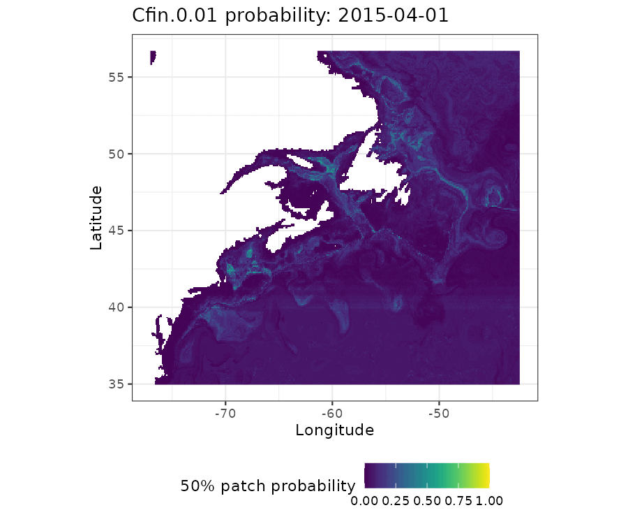
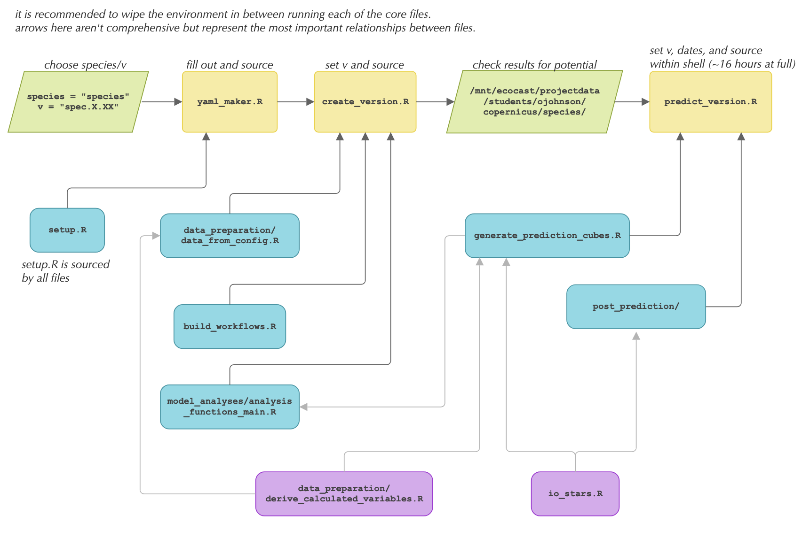

# Ecomon-Copernicus daily resolution species distribution models

This repository encompasses a pipeline for building 25-fold boosted regression tree (BRT) patch distribution models using [NOAA EcoMon](https://www.fisheries.noaa.gov/new-england-mid-atlantic/ecosystems/monitoring-ecosystem-northeast) abundance data and [Copernicus Marine Data Store](https://data.marine.copernicus.eu/products) oceanographic covariates

Output predictions are daily, 1/12° resolution predictions of a species patch from 1993 to 2019 within the Northeast Atlantic.

In addition, the `real_time_forecasts` folder hosts a Shiny application template for delivering real-time daily product. 

**Example output: Probability of a dense C. finmarchicus patch (ind/m2 > 30,000) in the Northeast Atlantic between April 1st and June 1st, 2015.**

## Modeling Pipeline & Reproduction

New model versions can be customized in the `yaml_maker.R` file. Configuration allows for choice of a species; patch threshold; source column within the [ecomon::scale_ecomon()](https://github.com/BigelowLab/ecomon/blob/7b32b94166c089ec271bf0e3c73196650169e1f6/R/io.R#L158) output or alternative custom dataset; set of selected copernicus and derived variables; and hyperparameter customization.

Steps: 

* Choose a species and input ecomon column. If using a custom abundance dataset, run methods in `data_preparation/generate_base_datasets.R` accordingly. 
* Fill out configuration information and version in `yaml_maker.R` and execute.
* Update species and version in `create_version.R` and execute. 
* Verify that configuration parameters resulted in adequate model output, either by checking RStudio plot/text outputs or going to model info folder at `mnt/ecocast/projectdata/students/ojohnson/copernicus/`
* Update species and version in `predict_version.R` and execute within a shell. Multiple species/version pairs can be run through 

